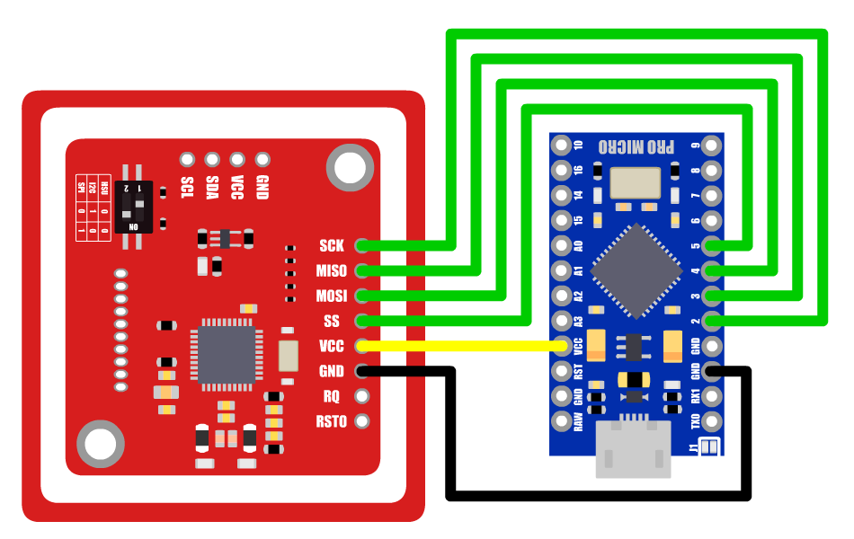

# Mifare 1k Reader

<h2>Hardware:</h2>

• <a href="https://www.amazon.com/gp/product/B01I1J17LC/">PN532</a> 
• <a href="https://www.amazon.com/OSOYOO-ATmega32U4-arduino-Leonardo-ATmega328/dp/B012FOV17O/">Arduino Pro Micro</a> (Cheaper In <a href="https://www.amazon.com/gp/product/B01MTU9GOB/">Bulk</a>) 
• <a href="https://www.amazon.com/Fermerry-Stranded-Flexible-Electric-Silicone/dp/B089CQZ33N">24 Gauge Copper Wire</a> 
• <a href="https://www.amazon.com/DOWELL-Stripper-Multi-Function-Tool%EF%BC%8CProfessional-Craftsmanship/dp/B07D25N45F">Wire Cutters</a> 
• <a href="https://www.amazon.com/Soldering-Iron-Kit-Temperature-Rarlight/dp/B07PDK3MX1">Soldering Iron</a> 
• <a href="https://www.amazon.com/AmazonBasics-Male-Micro-Cable-Black/dp/B0711PVX6Z/">Micro USB Cable</a> 
• <a href="https://www.shapeways.com/">Access To A 3d Printer</a> 

<h2>Software:</h2>

• <a href="https://www.arduino.cc/en/main/software">Arduino IDE</a> 
• <a href="https://nodejs.org/en/download/">Nodejs</a> 

<h2>STL files for 3d printing:</h2>

<h2>Pinout:</h2>

  

<h3 style="text-align:center;">SCK  >  Pin 2</h3>
<h3 style="text-align:center;">MISO  >  Pin 3</h3>
<h3 style="text-align:center;">MOSI  >  Pin 4</h3>
<h3 style="text-align:center;">SS  >  Pin 5</h3>
<h3 style="text-align:center;">VCC  >  VCC</h3>
<h3 style="text-align:center;">GND  >  GND</h3>

<h2>Installing Arduino IDE</h2> 

<h2>Installing Required Libraries</h2>